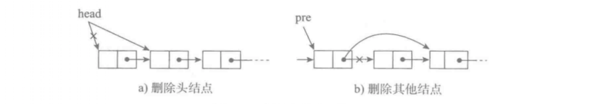

## 链表
链表（Linked list）是一种常见的基础数据结构，是一种线性表。

### 单链表
为建立起数据元素之间的线性关系，对每个数据元素，除了存放数据元素自身的数据信息data之外，还需要存放其后继元素所在的存储单元的地址next，这两部分信息组成一个「结点」。


它的每个节点包含两个域，一个信息域（元素数据）和一个链接域。这个链接指向链表中的下一个节点，而最后一个节点的链接域则指向一个空值。

+ 表元素域elem用来存放具体的数据。
+ 链接域next用来存放下一个节点的位置
+ 变量p指向链表的头节点（首节点）的位置，从p出发能找到表中的任意节点。

#### 节点实现
```
class SingleNode():
    """单链表的结点"""
    def __init__(self,data):
        # data存放数据元素
        self.data = data
        # _next是下一个节点的标识
        self.next = None
```

#### 单链表的操作
+ is_empty() 链表是否为空
+ length() 链表长度
+ travel() 遍历整个链表
+ add(item) 链表头部添加元素
+ append(item) 链表尾部添加元素
+ insert(pos, item) 指定位置添加元素
+ remove(item) 删除节点
+ search(item) 查找节点是否存在

#### 单链表实现
```
class SingleLinkList():
    """单链表"""
    def __init__(self):
        self._head = None

    def is_empty(self):
        """判断链表是否为空"""
        return self._head == None

    def length(self):
        """链表长度"""
        # cur初始时指向头节点
        cur = self._head
        count = 0
        # 尾节点指向None，当未到达尾部时
        while cur != None:
            count += 1
            # 将cur后移一个节点
            cur = cur.next
        return count

    def travel(self):
        """遍历链表"""
        cur = self._head
        while cur != None:
            print(cur.data,end='')
            cur = cur.next
        print()
```

#### 头部添加元素

```
    def add(self, item):
        """头部添加元素"""
        # 先创建一个保存item值的节点
        node = SingleNode(item)
        # 将新节点的链接域next指向头节点，即_head指向的位置
        node.next = self._head
        # 将链表的头_head指向新节点
        self._head = node
```
#### 尾部添加元素

```
    def append(self, data):
        """尾部添加元素"""
        node = SingleNode(data)
        # 先判断链表是否为空，若是空链表，则将_head指向新节点
        if self.is_empty():
            self._head = node
        # 若不为空，则找到尾部，将尾节点的next指向新节点
        else:
            cur = self._head
            while cur.next != None:
                cur = cur.next
            cur.next = node
```

#### 指定位置添加元素

```
    def insert(self, pos, data):
        """指定位置添加元素"""
        # 若指定位置pos为第一个元素之前，则执行头部插入
        if pos <= 0:
            self.add(data)
        # 若指定位置超过链表尾部，则执行尾部插入
        elif pos > (self.length()-1):
            self.append(data)
        # 找到指定位置
        else:
            node = SingleNode(data)
            count = 0
            # pre用来指向指定位置pos的前一个位置pos-1，初始从头节点开始移动到指定位置
            pre = self._head
            while count < (pos-1):
                count += 1
                pre = pre.next
            # 先将新节点node的next指向插入位置的节点
            node.next = pre.next
            # 将插入位置的前一个节点的next指向新节点
            pre.next = node
```
#### 删除节点


```
    def remove(self,data):
        """删除节点"""
        cur = self._head
        pre = None
        while cur != None:
            # 找到了指定元素
            if cur.data == data:
                # 如果第一个就是删除的节点
                if not pre:
                    # 将头指针指向头节点的后一个节点
                    self._head = cur.next
                else:
                    # 将删除位置前一个节点的next指向删除位置的后一个节点
                    pre.next = cur.next
                break
            else:
                # 继续按链表后移节点
                pre = cur
                cur = cur.next
```
#### 查找节点是否存在
```
    def search(self,data):
        """链表查找节点是否存在，并返回True或者False"""
        cur = self._head
        while cur != None:
            if cur.data == data:
                return True
            cur = cur.next
        return False
```

#### 测试
```
if __name__ == "__main__":
    ll = SingleLinkList()
    ll.add(1)
    ll.add(2)
    ll.append(3)
    ll.insert(2, 4)
    print("length:",ll.length())
    ll.travel()
    print(ll.search(3))
    print(ll.search(5))
    ll.remove(1)
    print("length:",ll.length())
    ll.travel()
```


